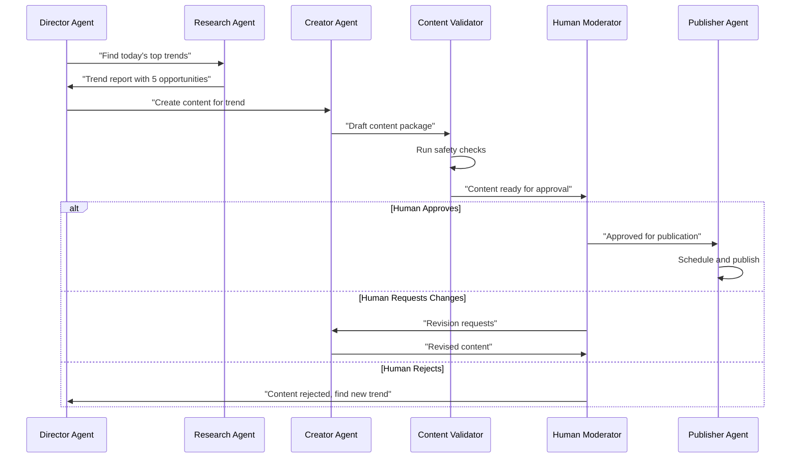
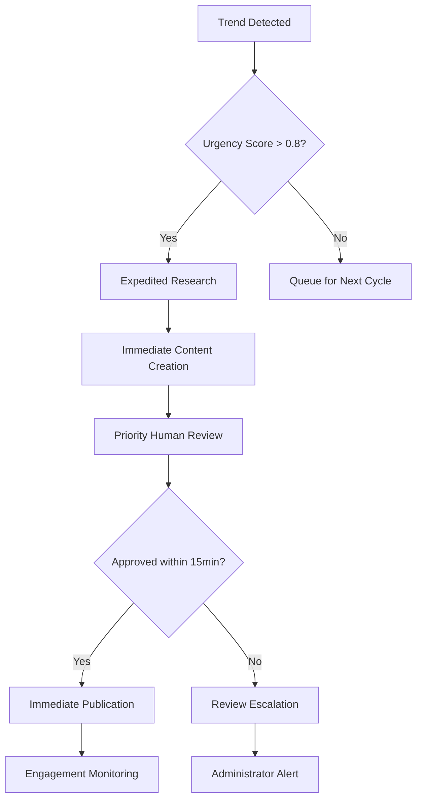

# Project Chimera: Functional Specification
*Version: 1.0.0*
*Ratification Date: February 5, 2025*

## User Stories

### Actor: Director Agent
**As the** Director Agent (DA-001)  
**I want to** orchestrate the content creation workflow  
**So that** all agents work in harmony toward strategic goals

**Acceptance Criteria:**
- DA-001 can assign tasks to specialized agents
- DA-001 receives status updates from all agents
- DA-001 can pause or redirect agent activities
- DA-001 maintains brand voice consistency across all content

### Actor: Research Agent
**As a** Research Agent (RA-001)  
**I want to** analyze trends across multiple platforms  
**So that** I can identify content opportunities

**Acceptance Criteria:**
- RA-001 can access YouTube, TikTok, and Instagram APIs
- RA-001 can process trend data in real-time
- RA-001 can score trends by relevance and velocity
- RA-001 can generate trend analysis reports
- RA-001 can store trend data in the database

**User Story:** RA-002 - Cross-platform Trend Correlation  
**As a** Research Agent  
**I want to** identify trends that are emerging across multiple platforms  
**So that** I can predict which content will have the widest reach

### Actor: Content Creator Agent
**As the** Content Creator Agent (CA-001)  
**I want to** generate engaging content based on trends  
**So that** we can capitalize on viral opportunities

**Acceptance Criteria:**
- CA-001 can create video scripts from trend data
- CA-001 can generate visual content descriptions
- CA-001 can adapt content for different platforms
- CA-001 can propose A/B testing variations
- CA-001 can estimate content performance

### Actor: Engagement Agent
**As the** Engagement Agent (EA-001)  
**I want to** manage audience interactions  
**So that** we can build community and increase reach

**Acceptance Criteria:**
- EA-001 can monitor comments and reactions
- EA-001 can generate appropriate responses
- EA-001 can identify high-value engagement opportunities
- EA-001 can flag negative sentiment for human review
- EA-001 can track engagement metrics over time

### Actor: Human Moderator
**As a** Human Moderator (HM-001)  
**I want to** review and approve all content  
**So that** we maintain quality and compliance

**Acceptance Criteria:**
- HM-001 receives content in an approval queue
- HM-001 can approve, reject, or request revisions
- HM-001 can provide feedback to agents
- HM-001 can set content scheduling
- HM-001 can access content performance history

### Actor: System Administrator
**As a** System Administrator (SA-001)  
**I want to** monitor and manage the agent system  
**So that** it operates reliably and efficiently

**Acceptance Criteria:**
- SA-001 can view agent health and performance
- SA-001 can restart or reconfigure agents
- SA-001 can access logs and audit trails
- SA-001 can manage API keys and credentials
- SA-001 can set rate limits and quotas

## Workflows
### Workflow 1: Daily Content Creation Cycle


### Workflow 2: Real-time Trend Response


### Workflow 3: Human-in-the-Loop Approval
1. **Submission:** Agent submits content to approval queue
2. **Notification:** Human moderator receives notification
3. **Review:** Moderator evaluates content against guidelines
4. **Decision:** Approve, reject, or request changes
5. **Feedback:** Agent receives decision with rationale
6. **Action:** Content published, revised, or abandoned

## Functional Requirements

### FR-001: Multi-Platform Trend Research
**ID:** FR-001  
**Priority:** High  
**Description:** System must research trends across YouTube, TikTok, and Instagram  
**Requirements:**
1. Support real-time API access to all three platforms
2. Process trend data at least every 15 minutes
3. Store trend history for at least 30 days
4. Generate trend velocity metrics (rate of growth)
5. Cross-correlate trends across platforms

### FR-002: Content Generation Pipeline
**ID:** FR-002  
**Priority:** High  
**Description:** System must generate platform-optimized content  
**Requirements:**
1. Create video scripts (60-180 seconds)
2. Generate shot lists and visual descriptions
3. Adapt content for each platform's format
4. Propose 3 variations for A/B testing
5. Include appropriate hashtags and metadata

### FR-003: Human Approval Interface
**ID:** FR-003  
**Priority:** Critical  
**Description:** Humans must approve all content before publication  
**Requirements:**
1. Web-based approval dashboard
2. Content preview with platform simulation
3. One-click approve/reject/revise
4. Scheduling interface for publication times
5. Audit trail of all approval decisions

### FR-004: Engagement Management
**ID:** FR-004  
**Priority:** Medium  
**Description:** System must manage audience interactions  
**Requirements:**
1. Monitor comments and reactions in real-time
2. Generate context-appropriate responses
3. Flag negative sentiment for human review
4. Track engagement metrics over time
5. Identify super-fans and brand advocates

### FR-005: Analytics & Reporting
**ID:** FR-005  
**Priority:** Medium  
**Description:** System must provide performance insights  
**Requirements:**
1. Real-time dashboard of key metrics
2. Historical performance analysis
3. ROI calculation for content
4. Agent performance tracking
5. Export capabilities for external analysis

### FR-006: OpenClaw Integration
**ID:** FR-006  
**Priority:** Low (Future)  
**Description:** System must integrate with agent social network  
**Requirements:**
1. Publish agent capabilities to OpenClaw
2. Accept tasks from external agents
3. Share anonymized trend insights
4. Participate in reputation system
5. Follow OpenClaw communication protocols

## Non-Functional Requirements

### Performance Requirements:
- **Trend Research:** Complete within 5 minutes
- **Content Generation:** Complete within 10 minutes
- **Approval Queue:** Process within 30 minutes (P95)
- **API Response:** < 200ms for all endpoints
- **Database Queries:** < 50ms for simple queries, < 1s for complex

### Scalability Requirements:
- Support 10,000 videos/month initial capacity
- Scale to 100,000 videos/month with linear cost increase
- Handle 100 concurrent human moderators
- Process 1,000+ trends/hour during peak events

### Reliability Requirements:
- **Uptime:** 99.5% monthly availability
- **Data Durability:** 99.999% (five nines)
- **Backup:** Daily automatic backups with 30-day retention
- **Recovery:** RTO < 4 hours, RPO < 15 minutes

### Security Requirements:
- **Authentication:** Multi-factor for human users
- **Authorization:** Role-based access control (RBAC)
- **Encryption:** TLS 1.3 in transit, AES-256 at rest
- **Audit:** Immutable audit trail of all actions
- **Compliance:** GDPR, CCPA, platform TOS

## Data Requirements

### Input Data:
- Platform API responses (trends, metrics, comments)
- Human feedback and approval decisions
- Agent performance metrics
- External data sources (news, weather, events)

### Output Data:
- Generated content (videos, images, text)
- Engagement responses
- Analytics reports
- Agent activity logs
- Audit trails

### Storage Requirements:
- **Hot Storage:** 30 days of active data (PostgreSQL + Redis)
- **Warm Storage:** 1 year of historical data (TimescaleDB)
- **Cold Storage:** Archived data (S3/Glacier)
- **Backups:** 30-day rotating backup schedule

## Dependencies

### External Dependencies:
- YouTube Data API v3
- TikTok Business API
- Instagram Graph API
- OpenAI API (GPT-4, DALL-E)
- Cloud provider (AWS/GCP/Azure)

### Internal Dependencies:
- PostgreSQL 15+ with TimescaleDB extension
- Redis 7+ Cluster
- Python 3.11+ runtime
- Docker 24+ for containerization

## Assumptions

### Technical Assumptions:
- Platform APIs will remain stable for 6 months
- AI model capabilities will continue to improve
- Internet connectivity is reliable (> 99% uptime)
- Cloud costs will remain within projected budget

### Business Assumptions:
- Content moderators will be available 16 hours/day
- Initial platforms (YT, TT, IG) will drive sufficient ROI
- Market demand for AI-generated content will grow
- Regulatory environment will allow AI content with disclosure

## Risks & Mitigations

### Technical Risks:
1. **API Rate Limiting:** Implement exponential backoff and caching
2. **Model Hallucination:** Multi-agent validation + human oversight
3. **Platform Policy Changes:** Abstract adapter layer with rapid updates
4. **Scalability Bottlenecks:** Microservices architecture with auto-scaling

### Business Risks:
1. **Audience Rejection:** Gradual introduction with clear AI disclosure
2. **Competitor Response:** Focus on niche verticals and unique capabilities
3. **Regulatory Changes:** Legal review and adaptable compliance framework
4. **Cost Overruns:** Usage-based pricing and optimization algorithms

## Success Validation

### Test Scenarios:
1. **Happy Path:** Complete content creation cycle in < 45 minutes
2. **Error Handling:** Graceful degradation when APIs are unavailable
3. **Scale Test:** Process 1,000 trends/hour without performance degradation
4. **Recovery Test:** Restore from backup within 4 hours

### Acceptance Tests:
- [ ] System can identify and respond to a viral trend within 1 hour
- [ ] All generated content passes human quality review
- [ ] No content violations or platform warnings for 30 days
- [ ] ROI exceeds 3x within first 90 days of operation
```
