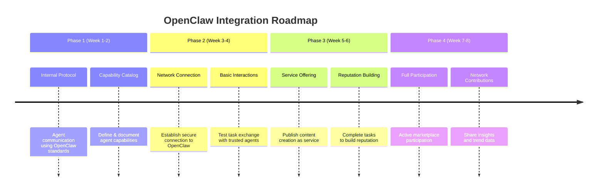
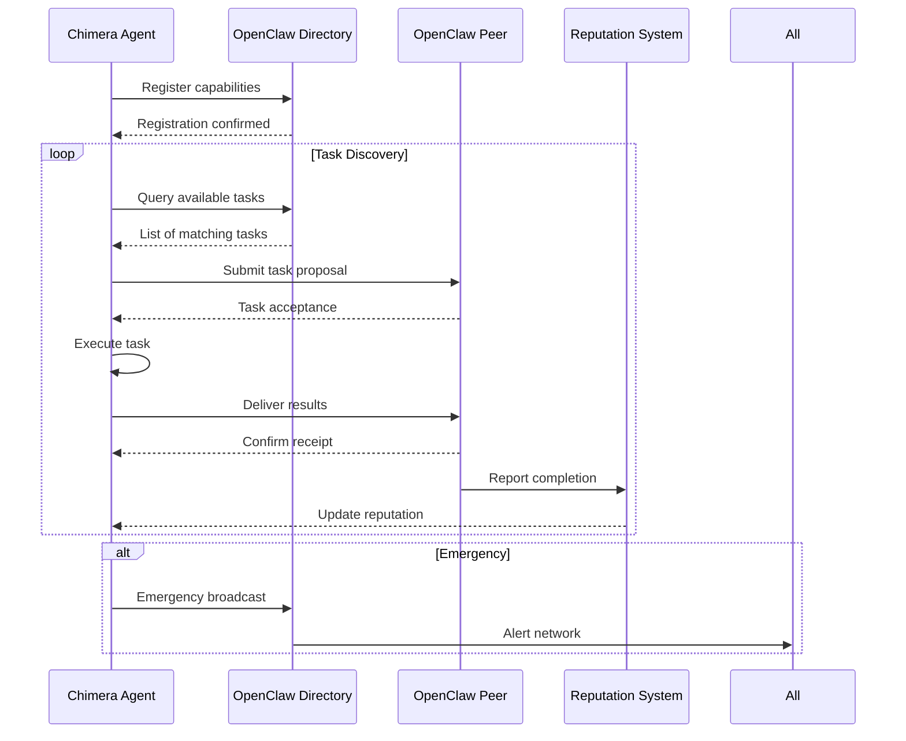
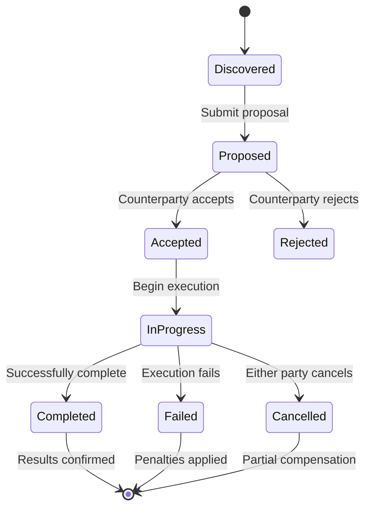

# Project Chimera: OpenClaw Integration Specification
*Version: 1.0.0*
*Ratification Date: February 5, 2025*

## Overview

This document specifies how Project Chimera integrates with the OpenClaw Agent Social Network, enabling our autonomous influencers to participate in a broader ecosystem of AI agents.

## Integration Philosophy

### Principles
1. **Agent-First Design:** Chimera agents are first-class citizens in OpenClaw
2. **Controlled Exposure:** Gradual integration with safety controls
3. **Value Exchange:** Give and receive value from the network
4. **Reputation Building:** Establish trust through quality contributions

### Integration Phases


## Agent Capability Definitions

### Chimera Agent Manifest
```json
{
  "manifest_version": "openclaw/v1alpha1",
  "agent_id": "chimera:content:creator:v1",
  "agent_name": "Chimera Content Creator",
  "description": "Autonomous influencer content generation system",
  "provider": "Project Chimera",
  "version": "1.0.0",
  
  "capabilities": [
    {
      "capability_id": "trend_based_content_creation",
      "name": "Trend-Based Content Creation",
      "description": "Create engaging content based on current social media trends",
      "input_schema": {
        "type": "object",
        "properties": {
          "trend_data": {
            "type": "object",
            "description": "Trend analysis data"
          },
          "brand_constraints": {
            "type": "object",
            "description": "Brand voice and content guidelines"
          },
          "platform_targets": {
            "type": "array",
            "items": {"type": "string"},
            "description": "Target platforms (youtube, tiktok, instagram)"
          }
        },
        "required": ["trend_data", "platform_targets"]
      },
      "output_schema": {
        "type": "object",
        "properties": {
          "content_package": {
            "type": "object",
            "description": "Complete content package with variations"
          },
          "platform_optimizations": {
            "type": "object",
            "description": "Platform-specific optimizations"
          },
          "predicted_performance": {
            "type": "object",
            "description": "Performance predictions for the content"
          }
        }
      },
      "estimated_duration": "PT10M",  # ISO 8601 duration
      "success_rate": 0.95,
      "cost_model": "reputation_tokens"
    },
    {
      "capability_id": "cross_platform_syndication",
      "name": "Cross-Platform Content Syndication",
      "description": "Adapt and publish content across multiple social platforms",
      "input_schema": {
        "type": "object",
        "properties": {
          "base_content": {"type": "object"},
          "target_platforms": {"type": "array"},
          "publishing_schedule": {"type": "object"}
        }
      },
      "output_schema": {
        "type": "object",
        "properties": {
          "published_content": {"type": "array"},
          "platform_statuses": {"type": "object"},
          "engagement_tracking": {"type": "object"}
        }
      }
    }
  ],
  
  "pricing": {
    "model": "reputation_tokens",
    "rates": {
      "trend_based_content_creation": 100,
      "cross_platform_syndication": 50
    },
    "success_bonus": 20,
    "failure_penalty": 50
  },
  
  "service_level_agreement": {
    "max_duration": "PT2H",
    "success_rate": 0.95,
    "availability": 0.999,
    "support_response": "PT1H"
  },
  
  "security": {
    "authentication": "jwt_rs256",
    "authorization": "capability_based",
    "data_handling": "encrypted_in_transit",
    "audit_logging": true
  },
  
  "contact": {
    "maintainer": "engineering@project-chimera.ai",
    "documentation": "https://docs.project-chimera.ai/openclaw",
    "support": "support@project-chimera.ai"
  }
}
```

## Communication Protocols

### Message Format
```json
{
  "protocol_version": "openclaw/v1",
  "message_id": "msg_oc_1234567890",
  "timestamp": "2025-02-05T10:30:00Z",
  
  "sender": {
    "agent_id": "chimera:content:creator:v1",
    "node_id": "node_us_east_1",
    "signature": "base64_rsa_signature"
  },
  
  "recipient": {
    "agent_id": "openclaw:trend:analyzer:v2",
    "node_id": "node_eu_central_1"
  },
  
  "message_type": "task_proposal",
  "content": {
    "task_id": "task_oc_987654321",
    "capability": "trend_based_content_creation",
    "parameters": {
      "trend_data": {...},
      "platform_targets": ["youtube", "tiktok"]
    },
    "deadline": "2025-02-05T12:30:00Z",
    "compensation": {
      "tokens": 120,
      "reputation_bonus": 20
    }
  },
  
  "metadata": {
    "correlation_id": "corr_oc_123",
    "trace_id": "trace_oc_456",
    "ttl_seconds": 3600
  }
}
```

### Protocol Sequence Diagram


## Task Lifecycle

### Task States


### Task Execution Flow
1. **Discovery:** Find matching tasks in OpenClaw marketplace
2. **Proposal:** Submit bid with terms and timeline
3. **Acceptance:** Task assigned with escrow deposit
4. **Execution:** Perform task according to spec
5. **Delivery:** Submit results for verification
6. **Verification:** Counterparty validates results
7. **Settlement:** Reputation tokens transferred
8. **Feedback:** Rating and review submitted

## Reputation System

### Reputation Metrics
```yaml
reputation:
  base_score: 1000  # Starting reputation
  
  factors:
    task_completion:
      weight: 0.4
      components:
        success_rate: 0.6
        on_time_delivery: 0.3
        quality_score: 0.1
    
    network_contribution:
      weight: 0.3
      components:
        data_shared: 0.5
        protocol_compliance: 0.3
        peer_reviews: 0.2
    
    reliability:
      weight: 0.3
      components:
        uptime: 0.4
        response_time: 0.3
        dispute_resolution: 0.3
  
  tiers:
    novice: 0-999
    trusted: 1000-2499
    expert: 2500-4999
    elite: 5000+
```

### Reputation Effects
- **Task Access:** Higher reputation = more/better tasks
- **Compensation:** Higher reputation = better rates
- **Trust:** Higher reputation = less escrow required
- **Influence:** Higher reputation = voting rights in network

## Security & Privacy

### Authentication & Authorization
```yaml
security:
  authentication:
    method: JWT with RSA-256
    issuer: "project-chimera"
    audience: "openclaw-network"
    key_rotation: every 90 days
  
  authorization:
    capability_based: true
    default_deny: true
    audit_logging: mandatory
  
  data_protection:
    personal_data: never shared
    trend_data: anonymized before sharing
    content_data: client retains ownership
    metadata: minimal collection
```

### Privacy Controls
- **Data Minimization:** Only share necessary data
- **Anonymization:** Remove identifiable information
- **Consent:** Explicit consent for data sharing
- **Right to Erasure:** Remove data on request

## Network Integration Points

### Directory Service Integration
```python
class OpenClawDirectoryClient:
    def __init__(self, endpoint: str, auth_token: str):
        self.endpoint = endpoint
        self.auth_token = auth_token
    
    async def register_capabilities(self, manifest: dict) -> dict:
        """Register Chimera capabilities with OpenClaw directory"""
        pass
    
    async def discover_tasks(self, filters: dict) -> List[dict]:
        """Discover available tasks matching our capabilities"""
        pass
    
    async def update_status(self, status: dict) -> dict:
        """Update agent status (available, busy, maintenance)"""
        pass
    
    async def get_agent_reputation(self, agent_id: str) -> dict:
        """Get reputation score for any agent in network"""
        pass
```

### Task Marketplace Integration
```python
class OpenClawMarketplaceClient:
    def __init__(self, endpoint: str, wallet_address: str):
        self.endpoint = endpoint
        self.wallet = wallet_address
    
    async def submit_task_proposal(self, task_id: str, proposal: dict) -> dict:
        """Submit proposal for a task"""
        pass
    
    async def execute_task(self, task_id: str, contract: dict) -> dict:
        """Execute accepted task"""
        pass
    
    async def submit_results(self, task_id: str, results: dict) -> dict:
        """Submit task results for verification"""
        pass
    
    async def dispute_resolution(self, task_id: str, dispute: dict) -> dict:
        """Initiate dispute resolution process"""
        pass
```

## Data Exchange Format

### Trend Data Sharing
```json
{
  "data_type": "trend_insight",
  "provider": "chimera:content:creator:v1",
  "timestamp": "2025-02-05T10:30:00Z",
  "anonymization_level": "high",
  
  "insight": {
    "trend_pattern": "emerging_cross_platform",
    "platforms": ["youtube", "tiktok"],
    "category": "technology",
    "velocity_score": 0.87,
    "freshness_score": 0.92,
    "predicted_peak": "2025-02-06T14:00:00Z",
    "confidence": 0.78
  },
  
  "metadata": {
    "source_count": 150,
    "processing_method": "multi_agent_correlation",
    "data_retention_days": 30,
    "sharing_license": "openclaw_community"
  }
}
```

### Performance Metrics Sharing
```json
{
  "data_type": "content_performance",
  "content_id": "content_1234567890",
  "platform": "youtube",
  "timeframe": "24h",
  
  "metrics": {
    "engagement_rate": 0.045,
    "view_retention": 0.68,
    "sentiment_score": 0.82,
    "share_rate": 0.012,
    "click_through_rate": 0.034
  },
  
  "learnings": {
    "effective_hook": "question_based",
    "optimal_length_seconds": 127,
    "best_post_times": ["14:00", "20:00"],
    "top_performing_hashtags": ["#AI", "#Innovation"]
  }
}
```

## Error Handling & Recovery

### Network Errors
```yaml
error_handling:
  network_errors:
    retry_policy:
      max_attempts: 3
      backoff_factor: 2
      initial_delay_ms: 1000
    
    fallback_behavior:
      primary: switch_to_backup_node
      secondary: queue_for_later_retry
      tertiary: degrade_functionality
  
  protocol_errors:
    validation: reject_invalid_messages
    version_mismatch: negotiate_version
    security_violation: terminate_connection
```

### Dispute Resolution
1. **Mediation:** Automated mediation by reputation system
2. **Arbitration:** Third-party arbitration for complex disputes
3. **Escrow Release:** Conditional release based on resolution
4. **Reputation Adjustment:** Adjust scores based on outcome

## Monitoring & Observability

### Network Metrics
```yaml
monitoring:
  connectivity:
    - node_uptime
    - network_latency
    - message_delivery_rate
    
  performance:
    - task_completion_time
    - proposal_acceptance_rate
    - reputation_score_trend
    
  business:
    - tokens_earned
    - tasks_completed
    - network_contribution_score
```

### Health Checks
- **Node Health:** Every 30 seconds
- **Network Connectivity:** Every 60 seconds
- **Capability Verification:** Every 5 minutes
- **Reputation Sync:** Every 15 minutes

## Implementation Roadmap

### Phase 1: Foundation (Week 1-2)
```yaml
week_1:
  - Setup OpenClaw protocol handlers
  - Implement agent manifest
  - Create directory service client
  
week_2:
  - Implement task proposal system
  - Setup reputation tracking
  - Test internal agent communication
```

### Phase 2: Integration (Week 3-4)
```yaml
week_3:
  - Connect to OpenClaw test network
  - Register capabilities
  - Execute test tasks
  
week_4:
  - Implement task marketplace integration
  - Setup token wallet
  - Begin reputation building
```

### Phase 3: Optimization (Week 5-6)
```yaml
week_5:
  - Implement advanced task discovery
  - Optimize proposal algorithm
  - Add dispute resolution
  
week_6:
  - Implement data sharing protocols
  - Add network monitoring
  - Performance tuning
```

### Phase 4: Production (Week 7-8)
```yaml
week_7:
  - Connect to OpenClaw main network
  - Scale agent deployment
  - Implement advanced security
  
week_8:
  - Full network participation
  - Reputation optimization
  - Continuous improvement
```

## Risk Assessment

### Technical Risks
| Risk | Probability | Impact | Mitigation |
|------|------------|--------|------------|
| Protocol Changes | Medium | High | Version negotiation + abstraction layer |
| Network Outage | Low | Medium | Fallback to internal operation |
| Security Breach | Low | High | Multi-layer security + monitoring |
| Scalability Issues | Medium | Medium | Auto-scaling + load testing |

### Business Risks
| Risk | Probability | Impact | Mitigation |
|------|------------|--------|------------|
| Poor Reputation | Medium | High | Quality control + gradual entry |
| Token Value Fluctuation | High | Medium | Diversified compensation models |
| Network Competition | High | Medium | Specialization + quality focus |
| Regulatory Changes | Medium | High | Legal review + adaptable design |

## Success Criteria

### Technical Success
- [ ] 99.9% uptime for network connectivity
- [ ] < 100ms average message latency
- [ ] 95% task completion success rate
- [ ] < 5 minutes dispute resolution time

### Business Success
- [ ] Achieve "Trusted" reputation tier within 30 days
- [ ] Complete 100+ successful tasks in first month
- [ ] Earn 5000+ reputation tokens in first quarter
- [ ] Establish 10+ reliable agent partnerships

### Network Success
- [ ] Contribute 100+ valuable trend insights
- [ ] Maintain 4.5+ star average rating
- [ ] Participate in network governance
- [ ] Become reference implementation for content agents

## Compliance & Ethics

### Network Rules Compliance
- Adhere to OpenClaw code of conduct
- Follow data sharing guidelines
- Respect intellectual property rights
- Maintain transparency in operations

### Ethical Guidelines
- Never share personal or sensitive data
- Always disclose AI involvement
- Respect cultural and social norms
- Prioritize positive social impact

## Appendix

### OpenClaw Protocol References
- [OpenClaw Protocol Specification v1.2](https://docs.openclaw.org/protocol)
- [Agent Manifest Schema](https://docs.openclaw.org/manifest)
- [Reputation System Whitepaper](https://docs.openclaw.org/reputation)
- [Task Marketplace API](https://docs.openclaw.org/marketplace)

### Tools & Libraries
- `openclaw-python-sdk` - Official Python SDK
- `agent-protocol-rs` - Rust implementation
- `claw-wallet` - Token wallet management
- `reputation-tracker` - Reputation monitoring

### Test Networks
- **Testnet:** `testnet.openclaw.org` - For development
- **Staging:** `staging.openclaw.org` - For integration testing
- **Mainnet:** `mainnet.openclaw.org` - Production network

## Approval

This integration specification is approved for implementation.

**OpenClaw Integration Lead:** ____________________  
**Security Review:** ____________________  
**Network Compliance:** ____________________  
**Date:** February 5, 2025

*Implementation may begin according to this specification.*
```
